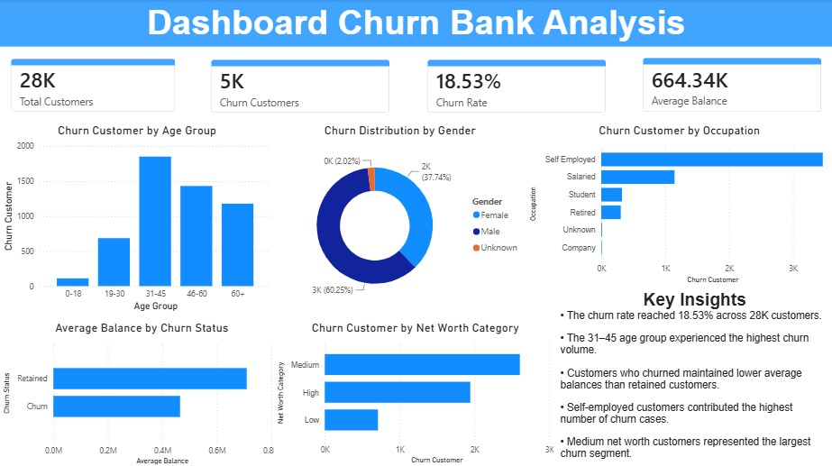

# 📊 Bank Customer Churn Analysis

## 📌 Project Overview

---

## 📊 Dashboard Preview



Customer churn is one of the biggest challenges in the banking industry because retaining existing customers is significantly more cost-effective than acquiring new ones. This project analyzes customer behavior using SQL, Python, and Power BI to identify the key characteristics of customers who are most likely to leave the bank and provide actionable business recommendations.

---

## Business Problem

Customer attrition directly impacts bank profitability.
Understanding which customer segments are more likely to churn helps businesses design targeted retention strategies and improve customer lifetime value.

--

Dataset

Source : Kaggle

Records : 28,000

Columns : 18

Target Variable :
Churn (0 = Retained, 1 = Churn)

--

## 🎯 Objectives

- Analyze customer churn patterns.
- Identify demographic groups with higher churn rates.
- Examine the relationship between account balance and churn.
- Explore churn behavior across occupations and customer segments.
- Create an interactive dashboard to support business decision-making.

---

## 🛠️ Tools & Technologies

- Microsoft Excel (Data Cleaning)
- SQL Server (Data Analysis)
- Python (EDA & Data Validation)
- Power BI (Dashboard Visualization)

---

## 📂 Project Workflow

### 1. Data Cleaning (Excel)

- Checked missing values.
- Handled inconsistent data.
- Validated data types.
- Reviewed duplicate records.
- Prepared dataset for analysis.

### 2. SQL Analysis

Performed analysis including:

- Total Customers
- Total Churn Customers
- Churn Rate
- Churn by Age Group
- Churn by Occupation
- Churn by Customer Net Worth Category
- Average Balance Analysis

### 3. Exploratory Data Analysis (Python)

- Missing Value Analysis
- Data Type Validation
- Descriptive Statistics
- Churn Distribution Analysis
- Correlation Analysis
- Data Visualization

### 4. Dashboard Development (Power BI)

Built an interactive dashboard containing:

- Total Customers
- Churn Customers
- Churn Rate
- Average Balance
- Churn by Age Group
- Churn Distribution by Gender
- Churn by Occupation
- Average Balance by Churn Status
- Churn by Net Worth Category
- Key Business Insights

---

## 📈 Key Findings

- The churn rate reached **18.53%** across **28K customers**.
- The **31–45 age group** experienced the highest churn volume.
- Churned customers maintained **lower average balances** than retained customers.
- **Self-employed customers** contributed the highest number of churn cases.
- **Medium net worth customers** represented the largest churn segment.

---

## 💡 Business Recommendations

Based on the analysis, the following strategies are recommended to reduce customer churn:

### 1. Target High-Risk Age Groups

Develop personalized retention campaigns for customers aged **31–45**, as this segment represents the highest number of churn cases. Promotional offers, financial planning services, and loyalty rewards can help improve customer retention.

### 2. Enhance Services for Self-Employed Customers

Since **self-employed customers** show the highest churn volume, the bank should introduce products tailored to their financial needs, such as flexible loan options, business banking services, and personalized financial consultations.

### 3. Increase Engagement with Low-Balance Customers

Customers who churn tend to maintain **lower account balances**. The bank can encourage higher account activity through cashback programs, savings incentives, and personalized promotions to strengthen customer engagement.

### 4. Strengthen Retention for Medium Net Worth Customers

As **medium net worth customers** account for the largest churn segment, targeted relationship management and exclusive banking benefits should be implemented to improve customer satisfaction and long-term loyalty.

### 5. Implement a Churn Monitoring Dashboard

Integrate customer demographic, financial, and behavioral indicators into a real-time monitoring dashboard. This enables the bank to identify customers with high churn risk early and take proactive retention actions before they leave.


--

## 📁 Repository Structure

```text
Analysis-Bank-Churn/
│
├── Data/
├── SQL/
├── Notebook/
├── PowerBI/
├── Dashboard/
│   └── dashboard.jpeg
│
└── README.md
```

---

## 🚀 Skills Demonstrated

- Data Cleaning
- SQL Querying
- Exploratory Data Analysis (EDA)
- Data Visualization
- Business Insight Generation
- Dashboard Development
- Problem Solving

---

## 👤 Author

**Ananda**

- LinkedIn: www.linkedin.com/in/anandabona
- GitHub: github.com/xpe0ple
